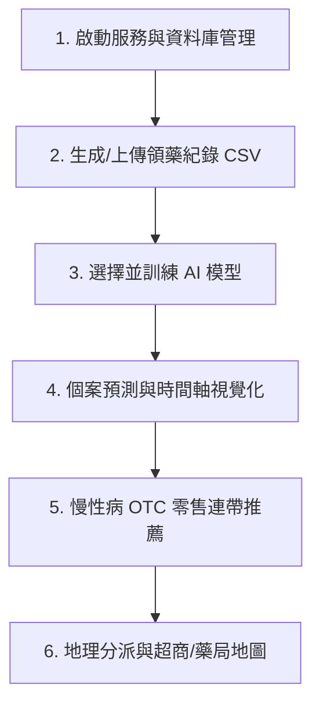

# Pharmacy Simulator - 智慧照護藥局模擬與慢性病用藥/零售預測系統

**Pharmacy Simulator** 是一套專為智慧藥局、連續處方箋管理與社區照護設計的端到端（End-to-End）模擬、 AI 用藥預測與零售連帶推薦系統。系統結合深度學習（LSTM、CVAE、Tabular DDPM 擴散模型）、機器學習與地理資訊 API（OpenStreetMap Overpass），提供一站式的資料管理、模型訓練、時間軸預測評估與藥局超商配送地圖。

---

## 資料夾與架構說明 (Directory Structure)

專案目錄結構如下所示：

```text
pharmacy_simulator/
├── app.py                      # Flask 後端伺服器與控制中樞 (REST API 路由、資料庫控制、模型推論)
├── fake_locations.py           # 地理位置服務 (Overpass API 抓取連鎖超商/藥局座標、距離分派計算)
├── config_generator.py         # 用藥與慢性病途徑設定檔 (config.csv) 生成器
├── seed_csv_generator.py       # 預設模擬領藥紀錄 CSV 種子資料生成腳本
├── requirements.txt            # Python 依賴套件清單 (Flask, PyTorch, Pandas, Scikit-learn 等)
├── README.md                   # 專案說明與操作使用流程文件 (本文件)
│
├── module/                     # 核心演算法與資料處理模組
│   ├── __init__.py
│   ├── model.py                # 臨床慢性病用藥與領藥天數預測模型 (LSTM, CVAE, Statistical ML)
│   ├── retail_pipeline.py      # 零售購物籃模擬與 OTC / 保健食品連帶推薦模型 (Product NN, Tabular DDPM)
│   ├── data.py                 # PyTorch ClinicalDataset 類別與特徵向量化
│   ├── data_generator.py       # ClinicalSimulationPipeline 臨床領藥歷史與疾病進程模擬器
│   └── plot.py                 # 時間軸比對圖表 (Model Prediction vs. Ground Truth) 視覺化繪製
│
├── databases/                  # SQLite 資料庫儲存目錄
│   ├── default.db              # 預設資料庫 (包含 convenience_stores 與 clinical_records 資料表)
│   └── project_new.db          # 自訂/測試資料庫快照
│
├── models/                     # 已訓練模型快照 checkpoints 儲存目錄
│   ├── model_20260709_220342/  # 模型快照與參數檔
│   └── model_20260709_220614/
│
├── config_data/                # 系統組態檔目錄
│   └── config.csv              # 慢性病種類、藥物天數與臨床用藥階梯對應表
│
└── templates/                  # 前端 UI 模版目錄
    └── index.html              # 響應式控制儀表板介面 (含資料庫切換、模型訓練、評估比對與地圖)
```

---

## 環境需求與安裝 (Installation)

### 1. 系統需求
- **Python**: 3.9 ~ 3.11
- **作業系統**: Windows / macOS / Linux

### 2. 安裝步驟
在專案根目錄開啟終端機，執行以下指令安裝依賴套件：

```bash
pip install -r requirements.txt
```

### 3. 啟動系統
執行主程式啟動 Flask 後端服務：

```bash
python app.py
```

啟動後，開啟瀏覽器造訪：[http://127.0.0.1:5001](http://127.0.0.1:5001)

---

## 系統使用與操作流程指南 (Usage Workflow)

系統的完整使用流程包含 **6 個主要階段**：



### 階段 1：資料庫管理與初始化 (Database Management)
1. 開啟 Web 控制頁面（`http://127.0.0.1:5001`）。
2. 在頂部導覽列切換 **「資料庫管理」** 頁籤。
3. 系統預設載入 `databases/default.db`。您可建立全新的 SQLite 資料庫或在多個 `.db` 檔之間動態切換。

### 階段 2：資料生成與 CSV 匯入/匯出 (Data Generation & Import/Export)
1. 在 **「模擬資料生成器」** 區塊，設定個案數量（預設 200 人）與模擬天數。
2. 點擊 **「生成模擬資料並寫入 DB」**，系統將自動模擬包含：高血壓、二型糖尿病、氣喘、高血脂與風濕關節炎等 5 大慢性病的處方領藥歷程。
3. 或使用 **「上傳 CSV」** 匯入現有的慢性病領藥歷史紀錄，或將當前資料庫紀錄 **「匯出為 CSV」**。

### 階段 3：AI 模型訓練 (Model Training)
在 **「模型訓練與設定」** 頁籤中，可選擇並訓練多種臨床用藥預測與零售推薦模型：

1. **CVAE (條件式變異自編碼器)**：結合 Focal Loss 與 10 次多重採樣集成 (Ensemble Sampling)，應對藥物品項稀疏性與正負樣本極度不平衡。
2. **Baseline LSTM (帶有疾病遮罩的序列 LSTM)**：學習個案歷史領藥序列，預測下次領藥間隔天數（`M_gap`）與開立藥物組合。
3. **Statistical Model (統計學模型)**：採用多輸出邏輯迴歸 (Logistic Regression) 與 Ridge 自迴歸 (AR) 模型。
4. **Tabular DDPM (表格去噪擴散概率模型)**：非處方零售商品（OTC/保健食品）推薦模型，採用 50 步馬可夫加噪與條件去噪 MLP。
5. **Product Recommender NN (零售推薦神經網路)**：雙層全連接推薦模型。

點擊 **「開始訓練模型」**，後端即時輸出 Training Log 與訓練損失 (Loss) 變化。

### 階段 4：個案預測與時間軸視覺化 (Client Prediction & Timeline Evaluation)
1. 進入 **「個案預測評估」** 頁籤。
2. 輸入特定個案編號（例如 `C_001`），點擊 **「載入預測結果」**。
3. 系統將即時產生視覺化時間軸對比圖：
   - **上軌 (Ground Truth)**：個案實際上採取的領藥時間點與處方藥物清單。
   - **下軌 (Model Prediction)**：AI 模型預測的領藥時間點與藥物組合。
   - **時間差標註**：誤差在 5 天內顯示藍色虛線，超過 5 天以橘線警示。

### 階段 5：慢性病 OTC 零售連帶推薦 (Retail Recommender)
1. 在 **「零售商品推薦」** 介面中，輸入顧客年齡與當前開立的慢性病處方藥。
2. 點擊 **「計算推薦商品」**，系統將整合衛教邏輯（例如高血壓顧客建議減少咖啡、糖尿病顧客推薦傷口包紮與低糖奶粉）輸出 Top 1~4 項建議連帶銷售的保健食品或日用品。

### 階段 6：地理分派與超商/藥局地圖 (Store Map & Distance Allocation)
1. 點擊 **「門市地圖與配送分派」**。
2. 系統可自動呼叫 OpenStreetMap Overpass API 抓取周邊的連鎖超商/合作藥局（如 7-Eleven、全家、萊爾富、 OK 或特約藥局）。
3. 依據曼哈頓/歐式距離演算法，自動為每一位慢性病個案匹配距離最近的門市配送點，並於地圖上以顏色標籤呈現分派結果。

---

## 🧠 AI 模型架構與數學定義說明

詳細模型數學推導、輸入輸出張量公式、損失函數與演算法定義，請參閱專屬文件：
👉 **[MODEL_MATHEMATICAL_FORMULATION.md](file:///c:/Users/ss348/Desktop/pharmacy_simulator/MODEL_MATHEMATICAL_FORMULATION.md)**

系統整合了深度產生式 AI (Generative AI)、序列神經網路與機器學習模組：

### 1. 慢性病處方用藥與領藥天數預測模型

1. **CVAE 條件式變異自編碼器 (Conditional VAE)**
   - **檔案位置**：[`module/model.py`](file:///c:/Users/ss348/Desktop/pharmacy_simulator/module/model.py)
   - **技術特點**：
     - 引入 **Focal Loss**（$\alpha=0.25, \gamma=2$）克服處方藥物稀疏性與正負樣本極度不平衡問題。
     - **時間記憶跳躍連接 (Temporal Skip Connection)**：將 LSTM 歷史序列記憶與潛在空間變數 $\mathbf{z}$ 融合，確保時間脈絡不遺失。
     - **多重採樣集成 (Ensemble Sampling)**：推論時進行 10 次潛在空間隨機採樣求平均機率。

2. **帶有疾病遮罩的序列 LSTM 模型 (Masked Sequence LSTM)**
   - **檔案位置**：[`module/model.py`](file:///c:/Users/ss348/Desktop/pharmacy_simulator/module/model.py)
   - **技術特點**：結合 LSTM 歷史領藥序列、Disease Embedding 疾病特徵與硬用藥遮罩 (Hard Disease Masking)，同步預測領藥天數與處方藥物。

3. **統計學預測模型 (Statistical Model)**
   - **檔案位置**：[`module/model.py`](file:///c:/Users/ss348/Desktop/pharmacy_simulator/module/model.py)
   - **技術特點**：使用多輸出邏輯迴歸 (Multi-Output Logistic Regression) 預測處方藥物，搭配 Ridge 自迴歸 (AR) 模型預測領藥間隔天數。

---

### 2. 藥局 OTC / 保健食品零售連帶推薦模型

1. **Tabular DDPM 表格去噪擴散概率模型 (Tabular Diffusion Model)**
   - **檔案位置**：[`module/retail_pipeline.py`](file:///c:/Users/ss348/Desktop/pharmacy_simulator/module/retail_pipeline.py)
   - **技術特點**：50 步高斯馬可夫鏈前向加噪與條件去噪 MLP 反向重建，結合顧客年齡與慢性疾病類別進行 **Context Embedding** 條件約束。

2. **零售推薦前饋神經網路 (ProductRecommenderNN)**
   - **檔案位置**：[`module/retail_pipeline.py`](file:///c:/Users/ss348/Desktop/pharmacy_simulator/module/retail_pipeline.py)
   - **技術特點**：雙層全連接神經網路 (MLP)，輸入年齡與慢性病用藥向量，輸出 10 大零售商品推薦機率。

---

## 📄 授權條款 (License)

本專案供學術研究與藥局照護模擬使用。


